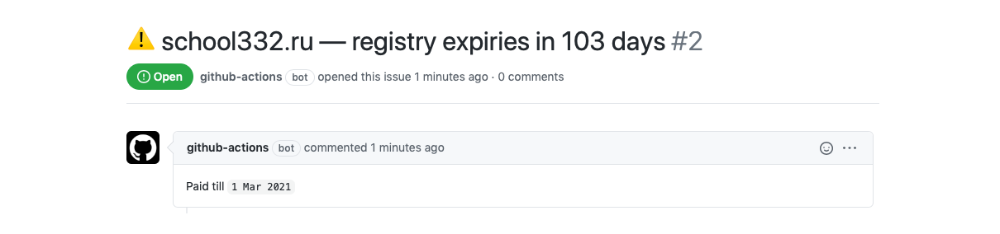

# Domain monitor

Watch SSL certs and registry date expiring for your domains.



## Inputs

### `url`

Site domain to be checked (with protocol).

## Outputs

### `ssl-expire-date`

SSL certificate expire date

### `ssl-expire-days-left`

SSL certificate expire number of days left

### `paid-till-date`

Registry Expiry Date

### `paid-till-days-left`

Registry Expiry number of days left

## Example usage

```yaml
- name: Check domain SSL and registry expire date
  id: check-domain
  uses: codex-team/action-check-domain@v1
  with:
    url`: ${{ matrix.domain }}

- run: echo 'SSL cert has ${{ steps.check-domain.outputs.ssl-expire-days-left }} days left'
  if: ${{ steps.check-domain.outputs.ssl-expire-days-left }}
```

### Advanced example

You can create a workflow based on this action for checking your domains.

Run will be scheduled by cron every day near 8:00 UTC (several minutes later because of github doesn't call your scripts at the time).

If paid till (or SSL lifespan days) number is below limit (for example 10 days) then will be created a new issue.

```yaml
name: Check domains

on:
  schedule:
    - cron:  '0 8 * * *'

jobs:
  hello:
    runs-on: ubuntu-latest
    name: Check domain
    strategy:
      matrix:
        domain:
          - https://codex.so
          - https://editorjs.io
    steps:
      - name: Check domain SSL and registry expire date
        id: check-domain
        uses: codex-team/action-check-domain@v1
        with:
          url: ${{ matrix.domain }}

      - name: Create an issue if paid till number is below limit 
        if: ${{ steps.check-domain.outputs.paid-till-days-left && steps.check-domain.outputs.paid-till-days-left < 10 }}
        uses: rishabhgupta/git-action-issue@v2
        with:
          token: ${{ secrets.GITHUB_TOKEN }}
          title: ⚠️ ${{ matrix.domain }} — registry expiries in ${{ steps.check-domain.outputs.paid-till-days-left }} days
          body: 'Till: `${{ steps.check-domain.outputs.paid-till-date }}`'

      - name: Create an issue if SSL lifespan days number is below limit 
        if: ${{ steps.check-domain.outputs.ssl-expire-days-left && steps.check-domain.outputs.ssl-expire-days-left < 10 }}
        uses: rishabhgupta/git-action-issue@v2
        with:
          token: ${{ secrets.GITHUB_TOKEN }}
          title: 🧨 ${{ matrix.domain }} — SSL cert expires in ${{ steps.check-domain.outputs.ssl-expire-days-left }} days
          body: 'Till: `${{ steps.check-domain.outputs.ssl-expire-date }}`'
``` 